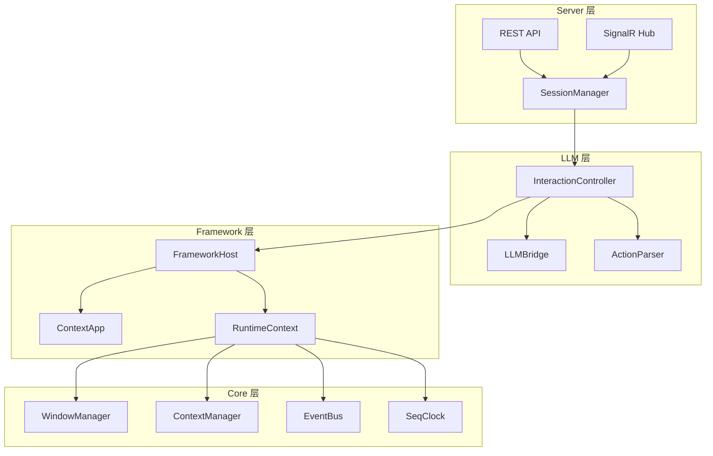
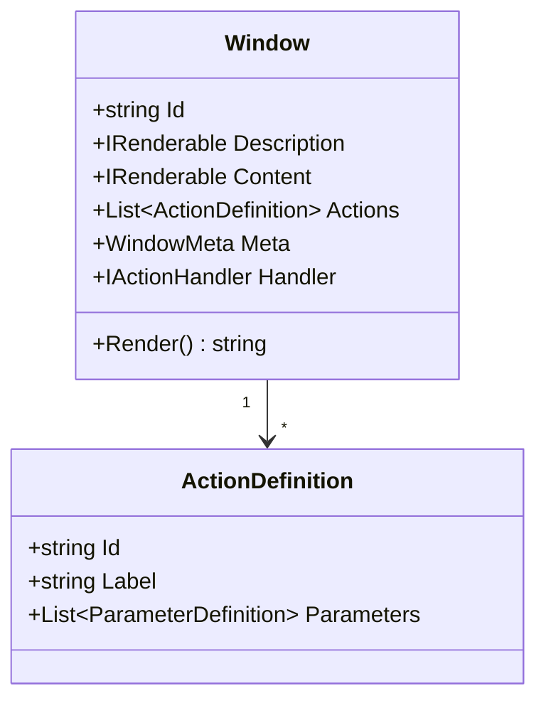
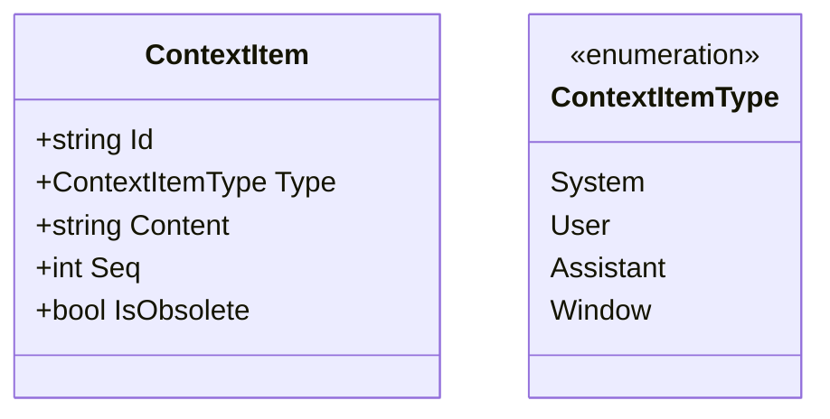
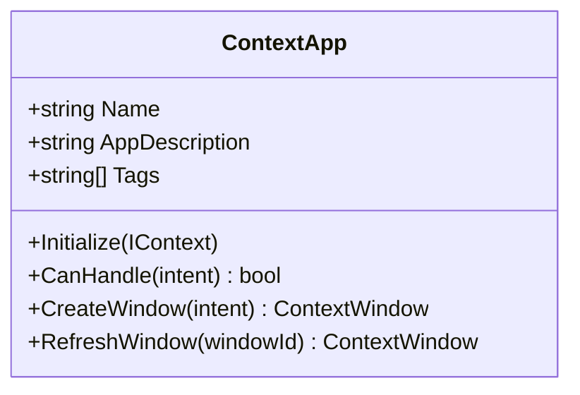
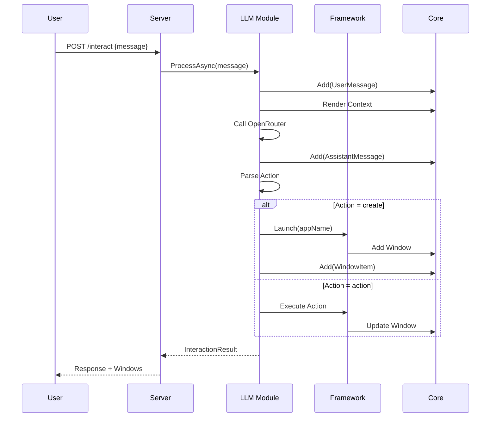

# ContextUI 系统架构总览

> 本文档描述 ContextUI 后端系统的整体架构设计。

## 1. 系统简介

ContextUI 是一个基于**窗口式交互**的 AI 应用框架。它将传统的 AI 对话转换为可操作的 UI 窗口，让 AI 能够通过结构化的操作与用户协作完成任务。

### 核心理念

```
传统对话模式：  User → AI → Text Response
ContextUI：     User → AI → Window Operations → Structured Feedback
```

## 2. 架构分层



## 3. 模块职责

| 模块 | 职责 | 依赖 |
|------|------|------|
| **Core** | 基础设施：窗口管理、上下文管理、事件总线、逻辑时钟 | 无 |
| **Framework** | 应用框架：应用生命周期、窗口创建、操作执行 | Core |
| **LLM** | AI 交互：LLM 调用、响应解析、上下文渲染 | Core, Framework |
| **Server** | HTTP 服务：会话管理、REST API、实时通信 | Core, Framework, LLM |

## 4. 核心概念

### 4.1 窗口（Window）

窗口是 ContextUI 的核心交互单元。每个窗口包含：

- **描述（Description）**：告诉 AI 这是什么、怎么操作
- **内容（Content）**：当前状态的结构化展示
- **操作（Actions）**：AI 可以执行的操作列表



### 4.2 上下文项（ContextItem）

对话历史中的每一条记录，按 `Seq` 排序。



### 4.3 应用（ContextApp）

封装了特定功能的独立单元，负责创建窗口并处理操作。



## 5. 数据流概览



## 6. 项目结构

```
backend.v2/
├── src/
│   ├── ContextUI.Core/           # 核心基础设施
│   │   ├── Abstractions/         # 接口定义
│   │   ├── Models/               # 数据模型
│   │   └── Services/             # 服务实现
│   │
│   ├── ContextUI.Framework/      # 应用框架
│   │   ├── Runtime/              # 运行时组件
│   │   ├── Components/           # UI 组件
│   │   └── BuiltIn/              # 内置应用
│   │
│   ├── ContextUI.LLM/            # LLM 集成
│   │   ├── Abstractions/         # 接口定义
│   │   └── Services/             # 服务实现
│   │
│   └── ContextUI.Server/         # HTTP 服务
│       ├── Endpoints/            # API 端点
│       ├── Hubs/                 # SignalR Hub
│       ├── Services/             # 服务层
│       └── Dto/                  # 数据传输对象
│
├── tests/                        # 测试项目
└── docs/                         # 文档
```

## 7. 文档索引

| 文档 | 说明 |
|------|------|
| [01-core-module.md](./01-core-module.md) | Core 模块详解 |
| [02-framework-module.md](./02-framework-module.md) | Framework 模块详解 |
| [03-llm-module.md](./03-llm-module.md) | LLM 模块详解 |
| [04-server-module.md](./04-server-module.md) | Server 模块详解 |
| [05-data-flow.md](./05-data-flow.md) | 数据流与生命周期 |
| [06-context-management.md](./06-context-management.md) | 上下文管理详解 |
| [07-api-reference.md](./07-api-reference.md) | API 参考 |
| [08-app-development.md](./08-app-development.md) | 应用开发指南 |
