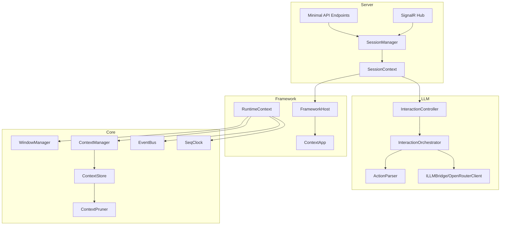

# ACI 系统架构总览（最新版）

> 本文档描述当前后端实现（`src/`）的实际架构与交互协议。

## 1. 系统定位

ACI（AgentContextInterface）是一个窗口化 AI 交互系统：

- AI 不直接“调用应用名创建窗口”，而是对**当前可见窗口**执行 action。
- 应用启动统一通过常驻 `launcher` 窗口的 `open` 操作完成。
- AI 输出 `<tool_call>` 后，系统会自动进入工具循环，直到模型返回非工具文本。

## 2. 分层架构



## 3. 当前协议要点

### 3.1 Tool Call 协议（推荐）

```xml
<tool_call>
{"calls":[{"window_id":"xxx","action_id":"yyy","params":{"k":"v"}}]}
</tool_call>
```

- `calls`：必填数组，可一次批量调用多个 action。
- `window_id` / `action_id`：必填。
- `params`：可选对象。
- `call_id` 不由模型提供，系统自动分配。
- 执行模式不由模型提供，来自窗口 action 元数据（`mode="async"` 或默认同步）。

### 3.2 启动应用方式

- `launcher` 窗口会在会话初始化时自动创建，且不可关闭、`PinInPrompt=true`。
- 启动应用通过 `launcher.open` action（返回 `data.action="launch"`），由 `InteractionController` 统一落地 `Host.Launch(...)`。

## 4. 模块职责

| 模块 | 职责 |
|------|------|
| `ACI.Core` | 窗口生命周期、上下文存储/裁剪、事件总线、逻辑时钟、动作执行与参数校验 |
| `ACI.Framework` | 应用模型与运行时、应用注册启动、窗口刷新、内置应用 |
| `ACI.LLM` | 系统提示词、tool_call 解析、交互循环编排、LLM 调用 |
| `ACI.Server` | 会话容器、HTTP/SignalR 对外接口、序列化执行与后台任务接线 |

## 5. 项目目录

```text
src/
  ACI.Core/
  ACI.Framework/
  ACI.LLM/
  ACI.Server/
docs/tech/
  00-overview.md
  01-core-module.md
  02-framework-module.md
  03-llm-module.md
  04-server-module.md
  05-data-flow.md
  06-context-management.md
  07-api-reference.md
  08-app-development.md
```

## 6. 阅读顺序

1. `01-core-module.md`
2. `02-framework-module.md`
3. `03-llm-module.md`
4. `04-server-module.md`
5. `05-data-flow.md`
6. `06-context-management.md`
7. `07-api-reference.md`
8. `08-app-development.md`
