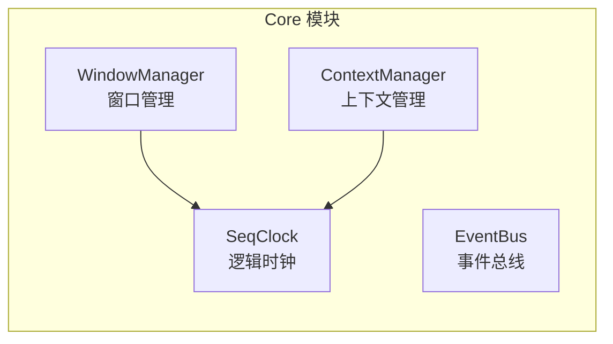
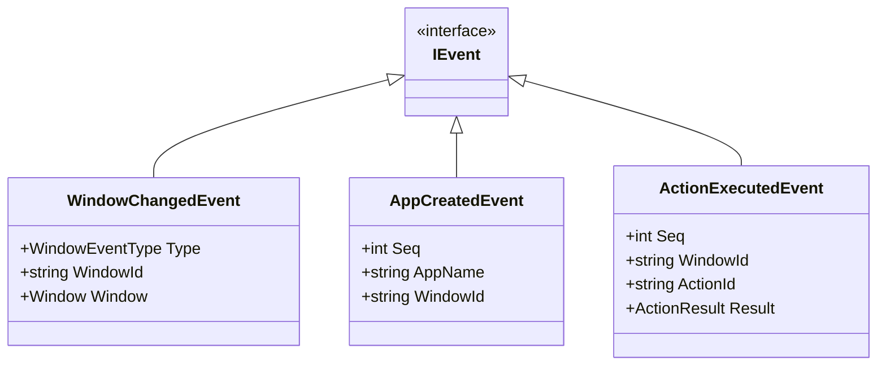
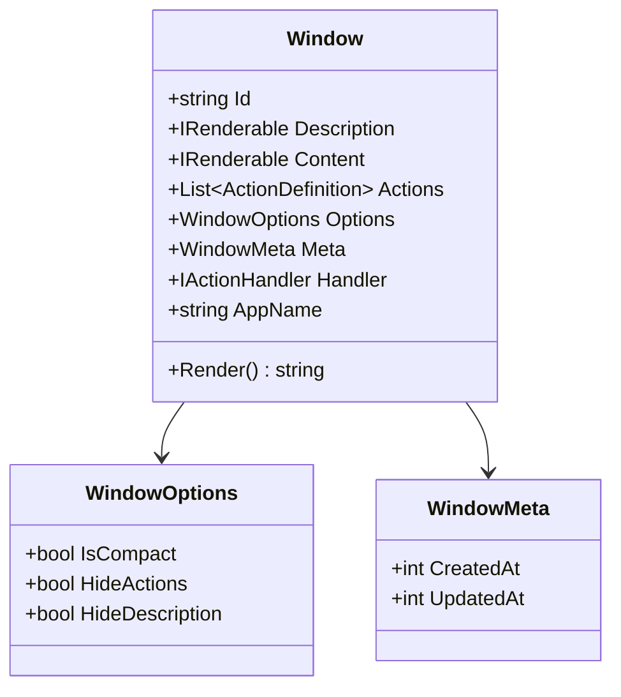
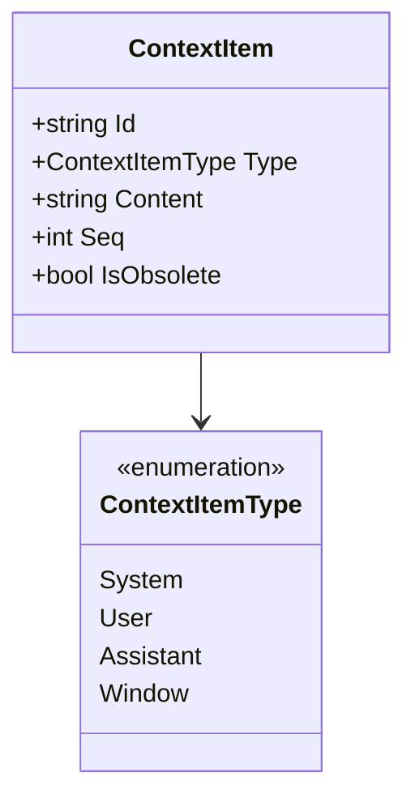
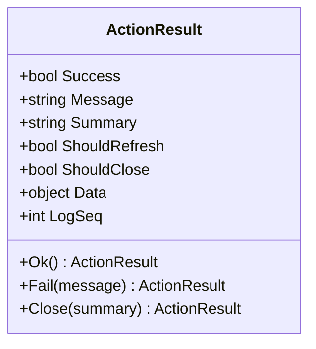

# Core 模块详解

> Core 模块提供 ContextUI 的基础设施，包括窗口管理、上下文管理、事件总线和逻辑时钟。

## 1. 模块概述

Core 是整个系统的基石，**零外部依赖**，提供以下核心能力：



## 2. 逻辑时钟（SeqClock）

### 2.1 设计意图

在分布式系统中，物理时间不可靠。`SeqClock` 提供单调递增的逻辑序列号，用于：

- 确定上下文项的顺序
- 标记事件发生的时间点
- 追踪窗口的创建/更新时间

### 2.2 接口定义

```csharp
public interface ISeqClock
{
    /// <summary>
    /// 当前序列号（只读）
    /// </summary>
    int CurrentSeq { get; }

    /// <summary>
    /// 获取下一个序列号（副作用：递增）
    /// </summary>
    int Next();
}
```

### 2.3 使用规范

| 场景 | 方法 | 说明 |
|------|------|------|
| 分配 ContextItem.Seq | `Next()` | 由 ContextManager 统一调用 |
| 事件时间戳 | `Next()` | 每个事件需要唯一的时间点 |
| 窗口 CreatedAt/UpdatedAt | `CurrentSeq` 或 `Next()` | 取决于是否需要递增 |

## 3. 事件总线（EventBus）

### 3.1 设计意图

提供松耦合的事件发布/订阅机制，解耦各模块之间的通信。

### 3.2 接口定义

```csharp
public interface IEventBus
{
    void Publish<T>(T evt) where T : IEvent;
    IDisposable Subscribe<T>(Action<T> handler) where T : IEvent;
}

public interface IEvent { }
```

### 3.3 内置事件类型



## 4. 窗口管理（WindowManager）

### 4.1 设计意图

集中管理所有活跃窗口的生命周期，提供窗口的 CRUD 操作和变更通知。

### 4.2 接口定义

```csharp
public interface IWindowManager
{
    Window? Get(string id);
    IEnumerable<Window> GetAll();
    IEnumerable<Window> GetAllOrdered();
    void Add(Window window);
    void Remove(string id);
    void NotifyUpdated(string id);
    event Action<WindowChangedEvent>? OnChanged;
}
```

### 4.3 窗口模型



### 4.4 渲染模式

窗口支持两种渲染模式：

| 模式 | 用途 | 输出结构 |
|------|------|----------|
| **标准模式** | 常规交互 | Description + Content + Actions |
| **精简模式** | 日志/状态显示 | 仅 Content |

```xml
<!-- 标准模式 -->
<Window id="todo_list">
  <Description>待办事项列表，支持增删改查</Description>
  <Content>
    <item id="1">买菜</item>
    <item id="2">写代码</item>
  </Content>
  <Actions>
    <action id="add">添加条目</action>
    <action id="delete">删除条目</action>
  </Actions>
</Window>

<!-- 精简模式 -->
<Window id="activity_log">
  [10] 用户打开了 TodoApp
  [11] AI 添加了条目 "买菜"
</Window>
```

## 5. 上下文管理（ContextManager）

### 5.1 设计意图

管理对话历史，维护上下文项的有序列表，支持按 `Seq` 排序和过期标记。

### 5.2 接口定义

```csharp
public interface IContextManager
{
    int CurrentSeq { get; }
    void Add(ContextItem item);
    IReadOnlyList<ContextItem> GetAll();
    IReadOnlyList<ContextItem> GetActive();
    void MarkWindowObsolete(string windowId);
}
```

### 5.3 上下文项模型



### 5.4 核心特性

#### Seq 统一分配

```csharp
public void Add(ContextItem item)
{
    item.Seq = _clock.Next();  // 由 ContextManager 统一分配
    _items.Add(item);
}
```

#### 过期标记

窗口关闭时，对应的 `ContextItem` 被标记为过期：

```csharp
public void MarkWindowObsolete(string windowId)
{
    foreach (var item in _items.Where(i => 
        i.Type == ContextItemType.Window && 
        i.Content == windowId))
    {
        item.IsObsolete = true;
    }
}
```

## 6. 操作处理（ActionHandler）

### 6.1 接口定义

```csharp
public interface IActionHandler
{
    Task<ActionResult> ExecuteAsync(ActionContext context);
}

public sealed class ActionContext
{
    public required Window Window { get; init; }
    public required string ActionId { get; init; }
    public Dictionary<string, object>? Parameters { get; init; }
    
    public string? GetString(string name);
    public int? GetInt(string name);
    public bool GetBool(string name, bool defaultValue = false);
}
```

### 6.2 ActionResult



## 7. 目录结构

```
ContextUI.Core/
├── Abstractions/
│   ├── ISeqClock.cs
│   ├── IEventBus.cs
│   ├── IWindowManager.cs
│   ├── IContextManager.cs
│   ├── IActionHandler.cs
│   └── IRenderable.cs
│
├── Models/
│   ├── Window.cs
│   ├── ActionDefinition.cs
│   ├── ActionResult.cs
│   └── ContextItem.cs
│
└── Services/
    ├── SeqClock.cs
    ├── EventBus.cs
    ├── WindowManager.cs
    ├── ContextManager.cs
    └── ContextRenderer.cs
```
