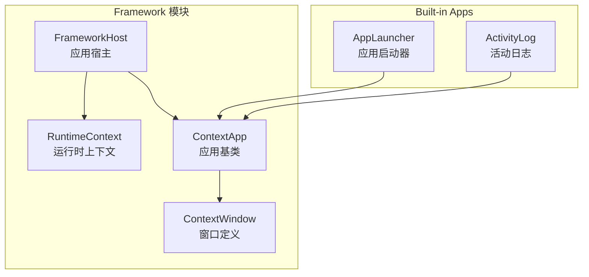
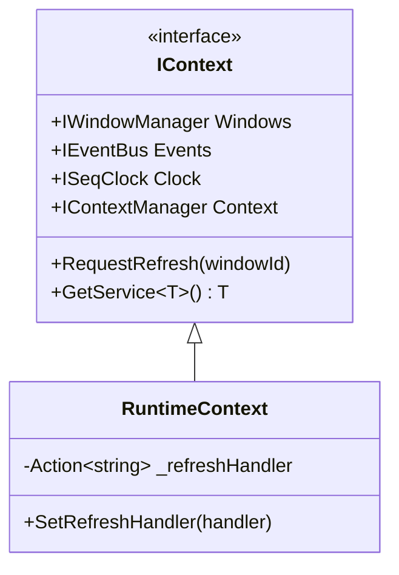
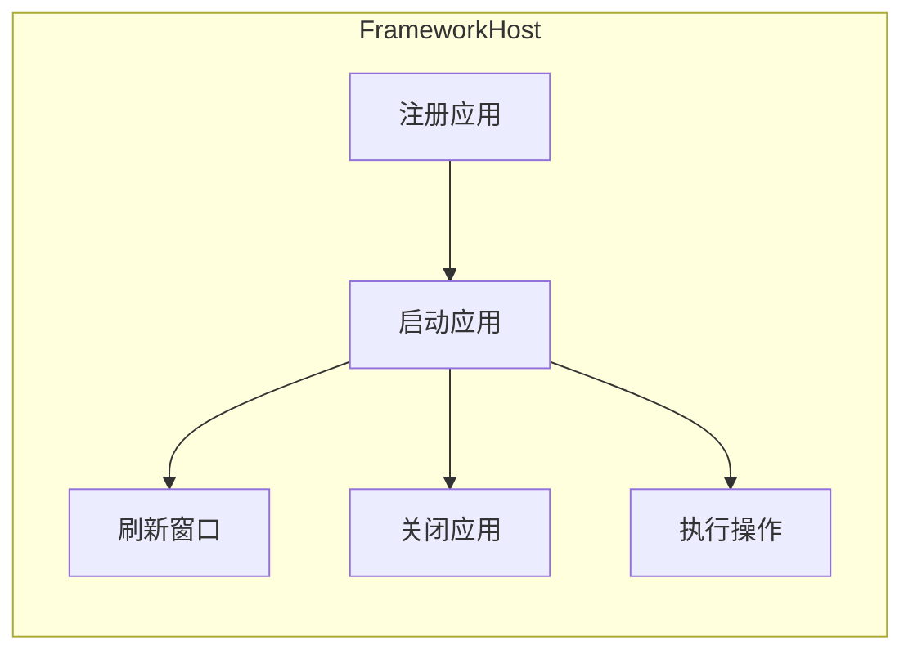
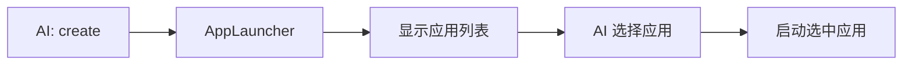
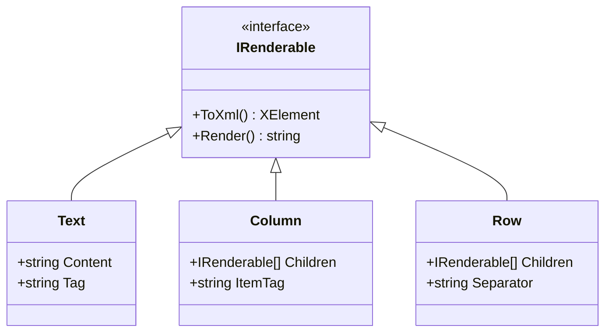

# Framework 模块详解

> Framework 模块提供应用运行时环境，包括应用生命周期管理、窗口创建和操作执行。

## 1. 模块概述

Framework 是连接 Core 和业务应用的桥梁，提供：



## 2. 运行时上下文（RuntimeContext）

### 2.1 设计意图

`RuntimeContext` 是 `IContext` 的实现，为应用提供访问所有 Core 服务的统一入口。

### 2.2 接口定义

```csharp
public interface IContext
{
    IWindowManager Windows { get; }
    IEventBus Events { get; }
    ISeqClock Clock { get; }
    IContextManager Context { get; }
    
    void RequestRefresh(string windowId);
    T? GetService<T>() where T : class;
}
```

### 2.3 类图



## 3. 应用宿主（FrameworkHost）

### 3.1 设计意图

`FrameworkHost` 管理所有应用的注册、启动、刷新和关闭，是应用生命周期的核心。

### 3.2 核心职责



### 3.3 关键方法

```csharp
public class FrameworkHost
{
    // 注册应用
    public void Register(ContextApp app);
    
    // 启动应用，创建窗口
    public Window Launch(string appName, string? intent = null);
    
    // 刷新窗口内容
    public void RefreshWindow(string windowId);
    
    // 关闭应用
    public void Close(string appName);
    
    // 执行窗口操作
    public Task<ActionResult> ExecuteActionAsync(
        string windowId, 
        string actionId, 
        Dictionary<string, object>? parameters = null);
    
    // 获取所有已注册应用
    public IEnumerable<AppInfo> GetApps();
}
```

### 3.4 窗口创建流程

```mermaid
sequenceDiagram
    participant Host as FrameworkHost
    participant App as ContextApp
    participant WM as WindowManager
    participant CM as ContextManager
    
    Host->>App: CreateWindow(intent)
    App-->>Host: ContextWindow
    Host->>Host: Convert to Window
    Host->>Host: Setup ActionHandler
    Host->>WM: Add(window)
    Host->>Host: Publish AppCreatedEvent
    Host-->>: Window
```

### 3.5 窗口刷新机制

窗口刷新是**原地更新**，保持窗口 ID 和上下文位置不变：

```csharp
public void RefreshWindow(string windowId)
{
    var window = _windows.Get(windowId);
    if (window == null) return;
    
    var appName = _windowToApp[windowId];
    var app = _apps[appName];
    var intent = _windowIntents[windowId];
    
    // 应用重新生成窗口定义
    var newDefinition = app.RefreshWindow(windowId, intent);
    
    // 原地更新内容和操作
    window.Content = newDefinition.Content;
    window.Actions.Clear();
    window.Actions.AddRange(newDefinition.Actions);
    window.Meta.UpdatedAt = _clock.Next();
    
    // 通知窗口更新
    _windows.NotifyUpdated(windowId);
}
```

## 4. 应用基类（ContextApp）

### 4.1 设计意图

`ContextApp` 是所有应用的基类，定义了应用的标准接口和生命周期。

### 4.2 类定义

```csharp
public abstract class ContextApp
{
    // 应用标识
    public abstract string Name { get; }
    public virtual string? AppDescription => null;
    public virtual string[] Tags => [];
    
    // 生命周期
    public virtual void Initialize(IContext context) { }
    public virtual void Dispose() { }
    
    // 窗口管理
    public abstract ContextWindow CreateWindow(string? intent);
    public virtual ContextWindow RefreshWindow(string windowId, string? intent = null)
        => CreateWindow(intent);
    
    // 意图匹配（用于智能启动）
    public virtual bool CanHandle(string intent) => false;
    
    // 便捷方法
    protected void RequestRefresh(string windowId);
}
```

### 4.3 应用开发示例

```csharp
public class TodoApp : ContextApp
{
    public override string Name => "todo";
    public override string? AppDescription => "管理待办事项";
    
    private List<string> _items = [];
    
    public override ContextWindow CreateWindow(string? intent)
    {
        return new ContextWindow
        {
            Description = new Text("待办事项列表"),
            Content = new Column(
                _items.Select((item, i) => 
                    new Text($"[{i}] {item}")).ToArray()
            ),
            Actions =
            [
                new("add", "添加", [new("text", "string")]),
                new("remove", "删除", [new("index", "int")])
            ],
            OnAction = HandleAction
        };
    }
    
    private Task<ActionResult> HandleAction(ActionContext ctx)
    {
        return ctx.ActionId switch
        {
            "add" => AddItem(ctx.GetString("text")),
            "remove" => RemoveItem(ctx.GetInt("index")),
            _ => Task.FromResult(ActionResult.Fail("未知操作"))
        };
    }
}
```

## 5. 窗口定义（ContextWindow）

### 5.1 设计意图

`ContextWindow` 是应用返回的窗口定义，由 Framework 转换为实际的 `Window` 对象。

### 5.2 类定义

```csharp
public class ContextWindow
{
    public string? Id { get; init; }
    public IRenderable? Description { get; init; }
    public required IRenderable Content { get; init; }
    public List<ActionDefinition> Actions { get; init; } = [];
    public WindowOptions? Options { get; init; }
    public Func<ActionContext, Task<ActionResult>>? OnAction { get; init; }
}
```

## 6. 内置应用

### 6.1 应用启动器（AppLauncher）

当 AI 使用 `create` 操作但不指定应用名时，自动显示可用应用列表。



### 6.2 活动日志（ActivityLog）

记录用户和 AI 的活动，使用精简模式显示。

特点：
- 精简模式（`IsCompact = true`）
- 自动收集事件（订阅 EventBus）
- 只显示最近 N 条记录

## 7. 内置组件

Framework 提供了基础 UI 组件用于构建窗口内容：



| 组件 | 用途 | 示例输出 |
|------|------|----------|
| `Text` | 文本内容 | `<p>Hello</p>` |
| `Column` | 垂直列表 | `<item>A</item><item>B</item>` |
| `Row` | 水平排列 | `A | B | C` |

## 8. 目录结构

```
ACI.Framework/
├── Runtime/
│   ├── IContext.cs
│   ├── RuntimeContext.cs
│   ├── FrameworkHost.cs
│   ├── ContextApp.cs
│   └── ContextWindow.cs
│
├── Components/
│   ├── Text.cs
│   ├── Column.cs
│   └── Row.cs
│
└── BuiltIn/
    ├── AppLauncher.cs
    └── ActivityLog.cs
```
