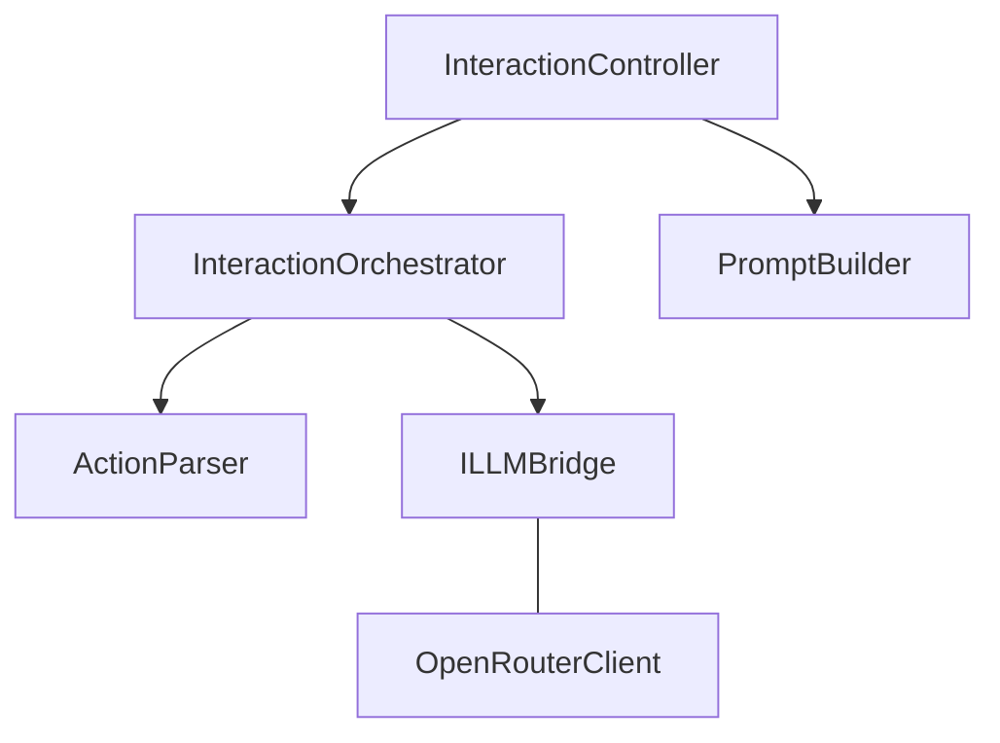

# LLM 模块详解（最新版）

> 对应代码：`src/ACI.LLM`

## 1. 模块职责

LLM 模块负责：

1. 将上下文渲染为消息并请求模型
2. 解析 `<tool_call>` 并执行窗口 action
3. 支持自动工具循环（连续 tool_call）
4. 记录执行步骤（`steps`）和 token 使用量

## 2. 组件结构



## 3. 当前 tool_call 协议

### 3.1 推荐格式

```xml
<tool_call>
{"calls":[{"window_id":"xxx","action_id":"yyy","params":{...}}]}
</tool_call>
```

字段说明：

- `calls`：必填数组
- `window_id`：必填
- `action_id`：必填
- `params`：可选对象

### 3.2 兼容格式

`ActionParser` 仍兼容单条结构：

```json
{"window_id":"...","action_id":"...","params":{...}}
```

### 3.3 非模型字段

- `call_id` 由系统根据回合和顺序生成（如 `call_2_1`）
- 执行模式由 action 元数据决定（`sync/async`），不是模型输入字段

## 4. 交互编排

### 4.1 InteractionOrchestrator

`ProcessUserMessageAsync` 核心流程：

1. 写入 `User` 上下文
2. 裁剪 + 渲染上下文
3. 请求 LLM
4. 写入 `Assistant` 上下文
5. 解析 tool_call
6. 若有调用则执行并继续下一轮；否则结束

循环上限：`MaxAutoToolCallTurns = 12`（超过即失败返回，防止死循环）。

### 4.2 InteractionController

职责：

- 初始化系统提示词（只注入一次）
- 执行动作并处理 `launch` 指令
- 异步动作分发到后台任务
- 产出 `InteractionStep`

`launch` 路径：

- action 返回 `data.action="launch"` 时，控制器调用 `Host.Launch(app, target)`
- 若 `close_source=true`，会追加执行来源窗口 `close`

## 5. 异步 action 支持

当动作元数据 `mode=async` 且注入了后台任务启动器时：

1. `ExecuteWindowActionAsync` 不阻塞会话交互
2. 立即返回：
   - `message: async task started: {taskId}`
   - `data.task_id`
3. 真实执行在后台任务中完成

`InteractionStep.TaskId` 会携带该任务 ID。

## 6. 返回模型

`InteractionResult` 关键字段：

- `Success`
- `Error`
- `Response`
- `Action`（最后一条解析动作）
- `ActionResult`（最后一条动作结果）
- `Steps`（本次所有工具调用步骤）
- `Usage`（累计 token）

`InteractionStep` 关键字段：

- `CallId`
- `WindowId` / `ActionId`
- `ResolvedMode`
- `Success` / `Message` / `Summary`
- `TaskId`
- `Turn` / `Index`

## 7. PromptBuilder 规则（当前）

系统提示词明确要求：

- 使用 `calls` 数组格式
- 不填写 call id
- 不填写执行模式
- `launcher` 窗口始终存在，应用启动走 launcher action

## 8. OpenRouter 客户端实现要点

`OpenRouterClient` 行为：

- 请求路径：`POST chat/completions`
- 请求体包含 `model/messages/max_tokens/temperature`
- 配置重试与模型降级（`LLMErrorHandler`）
- 当响应不是 JSON 时，返回错误：
  - `Failed to parse API response as JSON. Raw response: ...`

## 9. 目录结构

```text
ACI.LLM/
  Abstractions/
    ILLMBridge.cs
  Services/
    ActionParser.cs
    LLMErrorHandler.cs
    OpenRouterClient.cs
  InteractionController.cs
  InteractionOrchestrator.cs
  OpenRouterConfig.cs
  ParsedAction.cs
  PromptBuilder.cs
```
