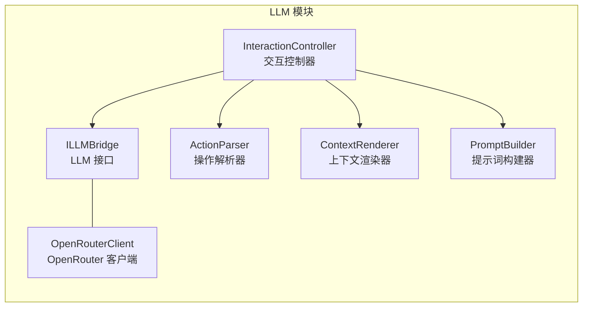
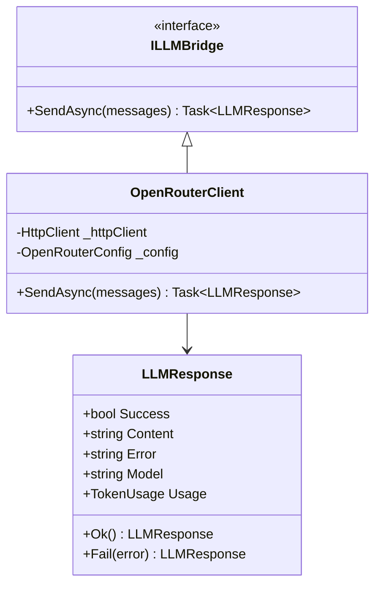
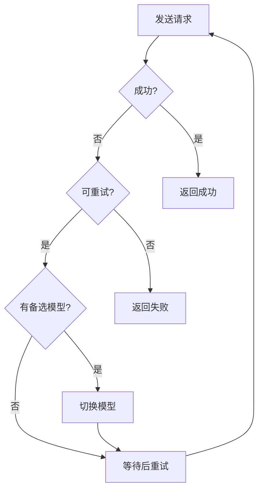
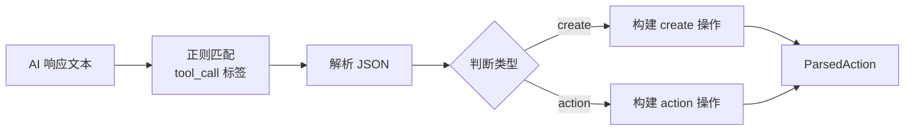
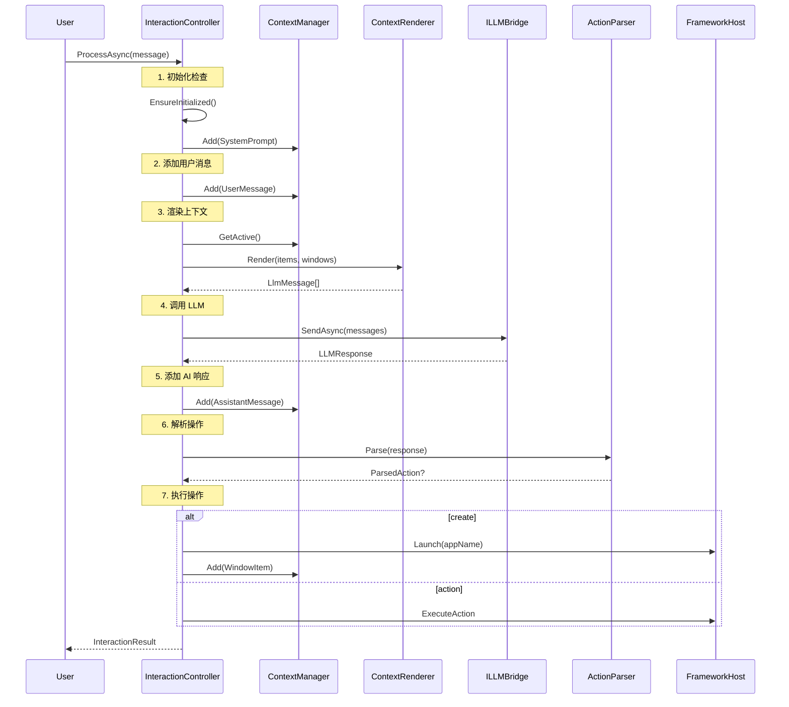

# LLM 模块详解

> LLM 模块负责与大语言模型的通信、响应解析和交互流程控制。

## 1. 模块概述

LLM 模块是 ContextUI 与 AI 世界的桥梁：



## 2. LLM Bridge 接口

### 2.1 设计意图

`ILLMBridge` 抽象了 LLM 调用，支持替换不同的 LLM 提供商。

### 2.2 接口定义

```csharp
public interface ILLMBridge
{
    Task<LLMResponse> SendAsync(
        IEnumerable<LlmMessage> messages, 
        CancellationToken ct = default);
}

public class LlmMessage
{
    public required string Role { get; init; }  // system, user, assistant
    public required string Content { get; init; }
}

public class LLMResponse
{
    public bool Success { get; set; }
    public string? Content { get; set; }
    public string? Error { get; set; }
    public string? Model { get; set; }
    public TokenUsage? Usage { get; set; }
}
```

### 2.3 类图



## 3. OpenRouter 客户端

### 3.1 设计意图

OpenRouter 提供统一的 API 访问多种 LLM（Claude、GPT、Gemini 等）。

### 3.2 配置

```csharp
public class OpenRouterConfig
{
    public const string SectionName = "OpenRouter";
    
    public string BaseUrl { get; set; } = "https://openrouter.ai/api/v1";
    public string ApiKey { get; set; } = string.Empty;
    public string DefaultModel { get; set; } = "anthropic/claude-3.5-sonnet";
    public List<string> FallbackModels { get; set; } = 
        ["openai/gpt-4-turbo", "google/gemini-pro"];
    public int MaxTokens { get; set; } = 4096;
    public double Temperature { get; set; } = 0.7;
    public int TimeoutSeconds { get; set; } = 60;
    public int MaxRetries { get; set; } = 3;
}
```

### 3.3 重试与降级策略



可重试的错误类型：
- HTTP 429（速率限制）
- HTTP 5xx（服务器错误）
- 请求超时

## 4. 操作解析器（ActionParser）

### 4.1 设计意图

从 AI 响应中提取结构化的操作指令。

### 4.2 解析格式

AI 响应中的操作指令使用 `<tool_call>` 标签包装：

```xml
<tool_call>
{"name": "create", "arguments": {"name": "todo", "target": "创建待办列表"}}
</tool_call>

<tool_call>
{"name": "action", "arguments": {"window_id": "xxx", "action_id": "add", "params": {"text": "买菜"}}}
</tool_call>
```

### 4.3 ParsedAction 模型

```csharp
public class ParsedAction
{
    public required string Type { get; set; }  // "create" | "action"
    
    // create 类型
    public string? AppName { get; set; }
    public string? Target { get; set; }
    
    // action 类型
    public string? WindowId { get; set; }
    public string? ActionId { get; set; }
    public Dictionary<string, object>? Parameters { get; set; }
}
```

### 4.4 解析流程



## 5. 交互控制器（InteractionController）

### 5.1 设计意图

`InteractionController` 是 LLM 模块的核心，协调整个交互流程：

1. 接收用户消息
2. 渲染上下文
3. 调用 LLM
4. 解析响应
5. 执行操作
6. 返回结果

### 5.2 类定义

```csharp
public class InteractionController
{
    private readonly ILLMBridge _llm;
    private readonly FrameworkHost _host;
    private readonly IContextManager _contextManager;
    private readonly IWindowManager _windowManager;
    private readonly IContextRenderer _renderer;
    private readonly RenderOptions _renderOptions;
    
    public Task<InteractionResult> ProcessAsync(
        string userMessage, 
        CancellationToken ct = default);
}
```

### 5.3 完整交互流程



### 5.4 操作执行

#### Create 操作

```csharp
private Task<ActionResult> ExecuteCreateAsync(ParsedAction action)
{
    var appName = action.AppName ?? "app_launcher";
    
    var window = _host.Launch(appName, action.Target);
    
    // 添加窗口到上下文
    _contextManager.Add(new ContextItem
    {
        Type = ContextItemType.Window,
        Content = window.Id
    });
    
    return Task.FromResult(ActionResult.Ok($"已打开应用: {appName}"));
}
```

#### Action 操作

```csharp
private async Task<ActionResult> ExecuteWindowActionAsync(ParsedAction action)
{
    var window = _windowManager.Get(action.WindowId);
    if (window == null)
        return ActionResult.Fail("窗口不存在");
    
    if (action.ActionId == "close")
    {
        _windowManager.Remove(action.WindowId);
        _contextManager.MarkWindowObsolete(action.WindowId);
        return ActionResult.Close(summary);
    }
    
    var context = new ActionContext
    {
        Window = window,
        ActionId = action.ActionId,
        Parameters = action.Parameters
    };
    
    var result = await window.Handler.ExecuteAsync(context);
    
    if (result.ShouldRefresh)
        _host.RefreshWindow(action.WindowId);
    
    if (result.ShouldClose)
    {
        _windowManager.Remove(action.WindowId);
        _contextManager.MarkWindowObsolete(action.WindowId);
    }
    
    return result;
}
```

### 5.5 交互结果

```csharp
public class InteractionResult
{
    public bool Success { get; init; }
    public string? Error { get; init; }
    public string? Response { get; init; }
    public ParsedAction? Action { get; init; }
    public ActionResult? ActionResult { get; init; }
    public TokenUsage? Usage { get; init; }
}
```

## 6. 提示词构建（PromptBuilder）

### 6.1 设计意图

构建系统提示词，告诉 AI 如何使用 ContextUI。

### 6.2 系统提示词结构

```markdown
# ContextUI 系统

你正在使用 ContextUI 系统与用户交互。

## 可用操作

### 1. create - 打开应用
<tool_call>
{"name": "create", "arguments": {"name": "app_name", "target": "意图"}}
</tool_call>

### 2. action - 执行窗口操作
<tool_call>
{"name": "action", "arguments": {"window_id": "xxx", "action_id": "yyy", "params": {...}}}
</tool_call>

### 3. close - 关闭窗口
<tool_call>
{"name": "action", "arguments": {"window_id": "xxx", "action_id": "close", "params": {"summary": "..."}}}
</tool_call>

## 规则

1. 只能操作当前上下文中活跃的窗口
2. 使用 summary 记录重要的操作结果
3. 窗口状态显示在对话历史中
```

## 7. 目录结构

```
ContextUI.LLM/
├── Abstractions/
│   └── ILLMBridge.cs
│
├── Services/
│   ├── OpenRouterClient.cs
│   ├── ActionParser.cs
│   └── LLMErrorHandler.cs
│
├── InteractionController.cs
├── ParsedAction.cs
├── OpenRouterConfig.cs
└── PromptBuilder.cs
```
