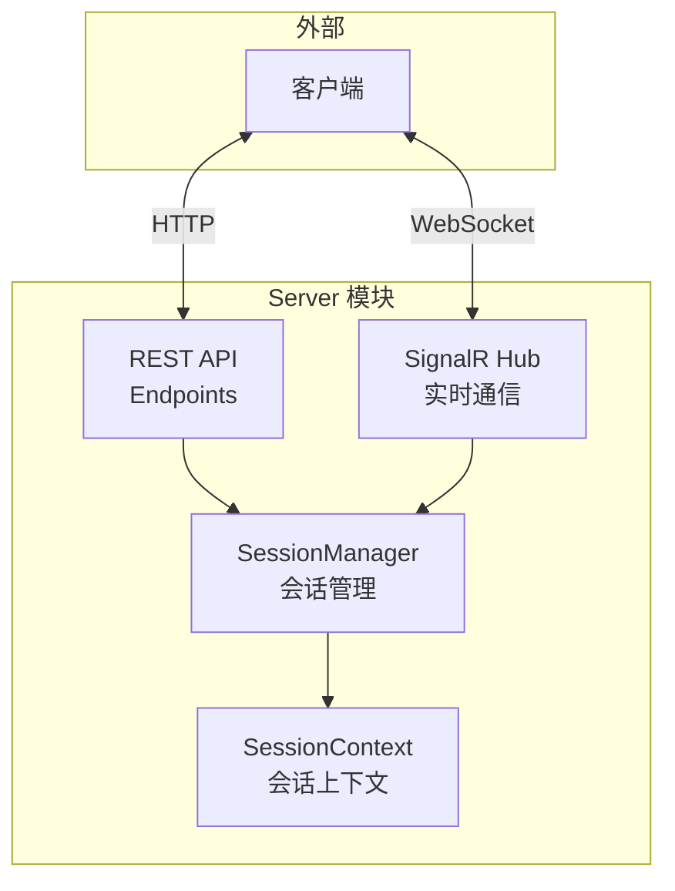
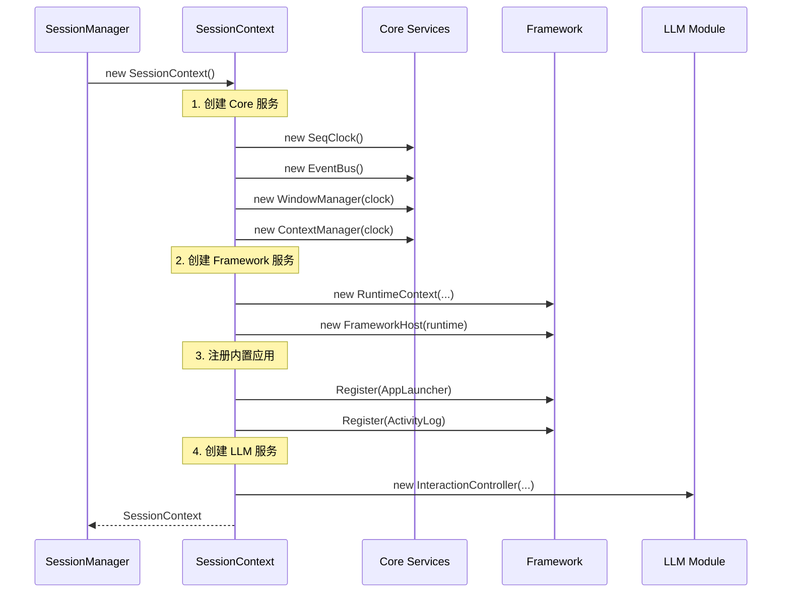
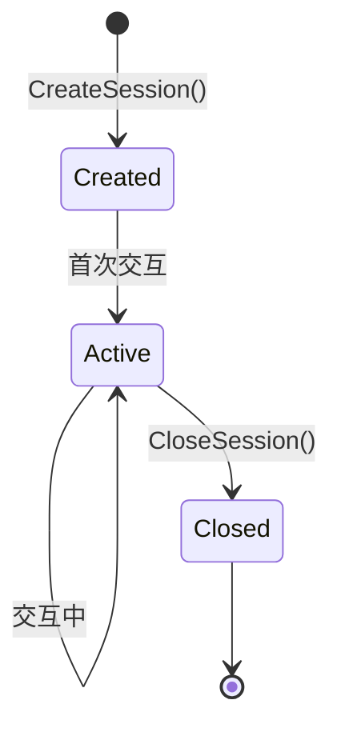
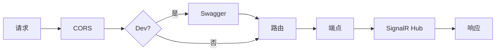

# Server 模块详解

> Server 模块提供 HTTP API 服务、会话管理和实时通信能力。

## 1. 模块概述

Server 模块是 ContextUI 的对外接口层：



## 2. 会话管理

### 2.1 设计意图

每个用户会话拥有独立的运行环境，包括独立的窗口、上下文和应用状态。

### 2.2 SessionContext

```csharp
public class SessionContext : IDisposable
{
    public string SessionId { get; }
    public DateTime CreatedAt { get; }
    
    // Core 服务
    public ISeqClock Clock { get; }
    public IEventBus Events { get; }
    public IWindowManager Windows { get; }
    public IContextManager Context { get; }
    
    // Framework 服务
    public RuntimeContext Runtime { get; }
    public FrameworkHost Host { get; }
    
    // LLM 服务
    public InteractionController Interaction { get; }
}
```

### 2.3 SessionContext 初始化流程



### 2.4 SessionManager

```csharp
public interface ISessionManager
{
    SessionContext CreateSession(string? sessionId = null);
    SessionContext? GetSession(string sessionId);
    void CloseSession(string sessionId);
    IEnumerable<string> GetActiveSessions();
    event Action<SessionChangeEvent>? OnSessionChange;
}
```

### 2.5 会话生命周期



## 3. REST API 端点

### 3.1 端点结构

| 分类 | 路径 | 说明 |
|------|------|------|
| 会话 | `/api/sessions` | 会话 CRUD |
| 交互 | `/api/sessions/{id}/interact` | AI 交互 |
| 窗口 | `/api/sessions/{id}/windows` | 窗口管理 |
| 健康 | `/health` | 健康检查 |

### 3.2 会话端点（SessionEndpoints）

```
GET    /api/sessions           获取所有会话
POST   /api/sessions           创建新会话
GET    /api/sessions/{id}      获取会话详情
DELETE /api/sessions/{id}      关闭会话
```

#### 创建会话

```http
POST /api/sessions
Content-Type: application/json

Response:
{
  "sessionId": "abc123...",
  "createdAt": "2024-01-20T10:30:00Z"
}
```

### 3.3 交互端点（InteractionEndpoints）

```
POST /api/sessions/{sessionId}/interact
```

#### 发送消息

```http
POST /api/sessions/abc123/interact
Content-Type: application/json

{
  "message": "帮我创建一个待办列表"
}

Response:
{
  "success": true,
  "response": "好的，我来帮你创建...<tool_call>...</tool_call>",
  "action": {
    "type": "create",
    "appName": "todo"
  },
  "actionResult": {
    "success": true,
    "message": "已打开应用: todo"
  },
  "usage": {
    "promptTokens": 1500,
    "completionTokens": 200,
    "totalTokens": 1700
  }
}
```

### 3.4 窗口端点（WindowEndpoints）

```
GET    /api/sessions/{id}/windows                   获取所有窗口
GET    /api/sessions/{id}/windows/{windowId}        获取窗口详情
POST   /api/sessions/{id}/windows/{windowId}/actions/{actionId}  执行操作
```

#### 获取所有窗口

```http
GET /api/sessions/abc123/windows

Response:
[
  {
    "id": "todo_12345",
    "description": "待办事项列表",
    "content": "<item>买菜</item><item>写代码</item>",
    "appName": "todo",
    "createdAt": 10,
    "updatedAt": 15
  }
]
```

#### 执行操作

```http
POST /api/sessions/abc123/windows/todo_12345/actions/add
Content-Type: application/json

{
  "params": {
    "text": "看电影"
  }
}

Response:
{
  "success": true,
  "message": "已添加条目"
}
```

## 4. SignalR Hub

### 4.1 设计意图

SignalR Hub 提供实时双向通信，用于推送窗口变更通知。

### 4.2 Hub 定义

```csharp
public class ContextUIHub : Hub
{
    // 客户端加入会话
    public Task JoinSession(string sessionId);
    
    // 客户端离开会话
    public Task LeaveSession(string sessionId);
}
```

### 4.3 客户端事件

| 事件 | 触发时机 | 数据 |
|------|----------|------|
| `JoinedSession` | 成功加入会话 | `sessionId` |
| `LeftSession` | 成功离开会话 | `sessionId` |
| `WindowCreated` | 新窗口创建 | 窗口信息 |
| `WindowUpdated` | 窗口内容更新 | 窗口信息 |
| `WindowClosed` | 窗口关闭 | `windowId` |
| `Error` | 发生错误 | 错误信息 |

### 4.4 通知器接口

```csharp
public interface IContextUIHubNotifier
{
    Task NotifyWindowCreated(string sessionId, Window window);
    Task NotifyWindowUpdated(string sessionId, Window window);
    Task NotifyWindowClosed(string sessionId, string windowId);
}
```

### 4.5 客户端使用示例

```javascript
// 连接 Hub
const connection = new signalR.HubConnectionBuilder()
    .withUrl("/hubs/contextui")
    .build();

// 监听窗口创建
connection.on("WindowCreated", (window) => {
    console.log("新窗口:", window);
});

// 监听窗口更新
connection.on("WindowUpdated", (window) => {
    console.log("窗口更新:", window);
});

// 启动连接并加入会话
await connection.start();
await connection.invoke("JoinSession", sessionId);
```

## 5. 服务注册

### 5.1 Program.cs 配置

```csharp
var builder = WebApplication.CreateBuilder(args);

// CORS
builder.Services.AddCors(options => { ... });

// SignalR
builder.Services.AddSignalR();

// OpenRouter 配置
builder.Services.Configure<OpenRouterConfig>(
    builder.Configuration.GetSection("OpenRouter"));

// HTTP Client
builder.Services.AddHttpClient<ILLMBridge, OpenRouterClient>();

// 会话管理器
builder.Services.AddSingleton<ISessionManager>(sp => {
    var llmBridge = sp.GetRequiredService<ILLMBridge>();
    return new SessionManager(llmBridge);
});

// Hub 通知器
builder.Services.AddSingleton<IContextUIHubNotifier, ContextUIHubNotifier>();

// Swagger
builder.Services.AddEndpointsApiExplorer();
builder.Services.AddSwaggerGen();
```

### 5.2 中间件管道



## 6. 配置

### 6.1 appsettings.json

```json
{
  "OpenRouter": {
    "ApiKey": "sk-or-v1-...",
    "DefaultModel": "anthropic/claude-3.5-sonnet",
    "MaxTokens": 4096,
    "Temperature": 0.7
  },
  "Logging": {
    "LogLevel": {
      "Default": "Information"
    }
  }
}
```

### 6.2 launchSettings.json

```json
{
  "profiles": {
    "http": {
      "commandName": "Project",
      "applicationUrl": "http://localhost:5000",
      "environmentVariables": {
        "ASPNETCORE_ENVIRONMENT": "Development"
      }
    }
  }
}
```

## 7. 请求/响应模型

### 7.1 DTO 定义

```csharp
// 消息请求
public class MessageRequest
{
    public required string Message { get; set; }
}

// 交互响应
public class InteractionResponse
{
    public bool Success { get; set; }
    public string? Error { get; set; }
    public string? Response { get; set; }
    public ActionInfo? Action { get; set; }
    public ActionResultInfo? ActionResult { get; set; }
    public TokenUsageInfo? Usage { get; set; }
}

// 操作信息
public class ActionInfo
{
    public string? Type { get; set; }
    public string? AppName { get; set; }
    public string? WindowId { get; set; }
    public string? ActionId { get; set; }
}
```

## 8. 目录结构

```
ContextUI.Server/
├── Endpoints/
│   ├── SessionEndpoints.cs
│   ├── InteractionEndpoints.cs
│   └── WindowEndpoints.cs
│
├── Hubs/
│   └── ContextUIHub.cs
│
├── Services/
│   ├── SessionContext.cs
│   └── SessionManager.cs
│
├── Dto/
│   └── ApiModels.cs
│
├── Properties/
│   └── launchSettings.json
│
├── Program.cs
├── appsettings.json
└── appsettings.Development.json
```
