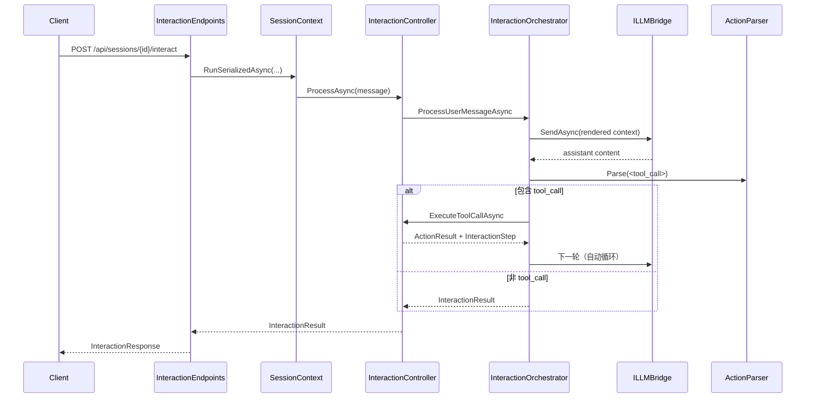
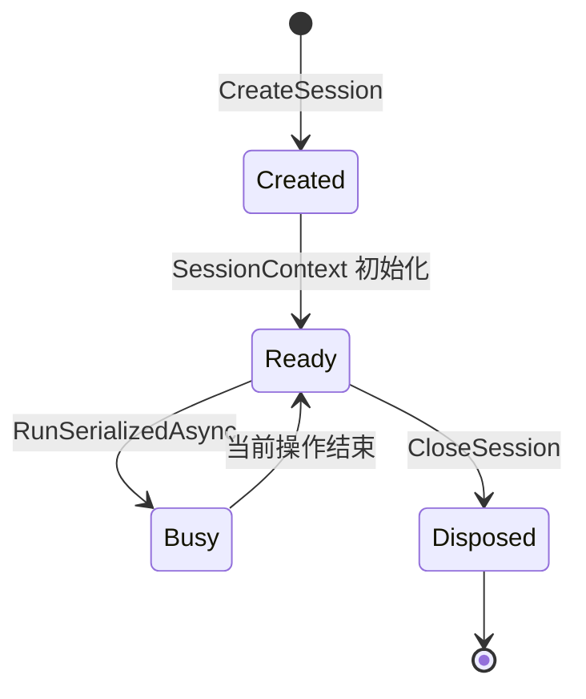

# 数据流与生命周期（最新版）

> 本文档描述当前实现中的关键运行链路。

## 1. 用户消息主链路

## 2. 自动工具循环

`InteractionOrchestrator` 行为：

1. 每轮先 `PruneContext`
2. 渲染上下文并请求 LLM
3. 若解析到 tool_call，按顺序执行 `calls[]`
4. 累计 `steps` 与 `usage`
5. 直到返回非 tool_call，或达到上限（12 轮）

## 3. 窗口生命周期

### 3.1 创建

1. `FrameworkHost.Launch(app, intent)`
2. `ContextApp.CreateWindow`
3. 写入 `WindowManager.Add`
4. 触发 `WindowChangedEvent(Created)`
5. `SessionContext.OnWindowChanged` 新增 `ContextItem(Window)`

### 3.2 刷新

1. `FrameworkHost.RefreshWindow(windowId)`
2. `ContextApp.RefreshWindow`
3. 原地更新窗口对象
4. `WindowManager.NotifyUpdated`
5. 若 `RefreshMode=Append`，追加新的 `ContextItem(Window)`

### 3.3 关闭

1. `ActionExecutor` 执行 `close` 或 `ShouldClose=true`
2. `WindowManager.Remove`
3. `SessionContext.OnWindowChanged` 标记窗口上下文 `IsObsolete=true`

## 4. 异步动作与后台任务

当 action `mode=async`：

1. `InteractionController` 立即通过 `startBackgroundTask` 派发
2. HTTP 响应先返回 `task_id`
3. 后台任务执行时，状态回写通过 `RunSerializedActionAsync` 进入会话串行上下文
4. 生命周期事件：
   - `Started`
   - `Completed`
   - `Failed`
   - `Canceled`

## 5. 会话生命周期

## 6. 事件主干

核心事件来源：

- `WindowManager`：`WindowChangedEvent`
- `ActionExecutor`：`ActionExecutedEvent`
- `FrameworkHost`：`AppCreatedEvent`、`WindowRefreshedEvent`
- `SessionTaskRunner`：`BackgroundTaskLifecycleEvent`

内置日志应用 `activity_log` 会订阅并输出为紧凑窗口。

## 7. 一致性保证

### 7.1 串行一致性

同一会话的：

- 交互请求
- 手动模拟请求
- 窗口 action 调用
- 后台任务状态回写

都被序列化到同一 `SessionContext` 执行通道。

### 7.2 上下文与窗口解耦

`ContextItem(Window)` 只存 `windowId`，渲染时实时读取窗口对象：

- 保证刷新后上下文始终是最新内容
- 关闭后自动不可渲染（窗口不存在）
