# 数据流与生命周期

> 本文档详细描述 ACI 系统中的数据流动和关键对象的生命周期。

## 1. 用户交互完整流程

### 1.1 时序图

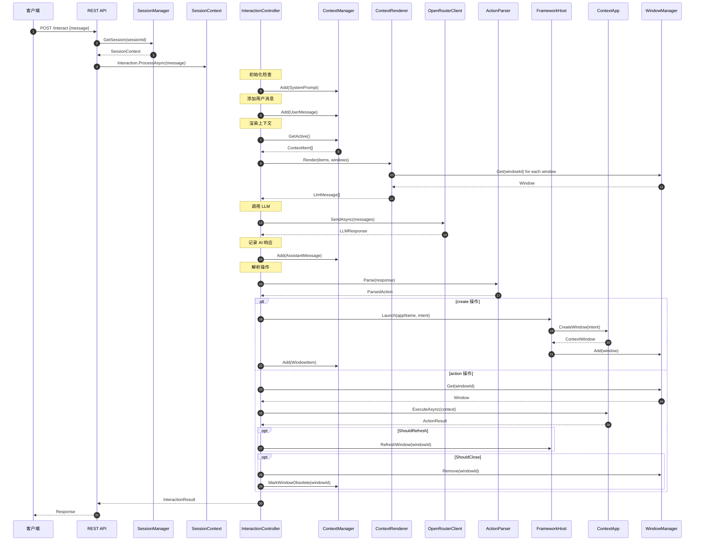

## 2. 窗口生命周期

### 2.1 状态图

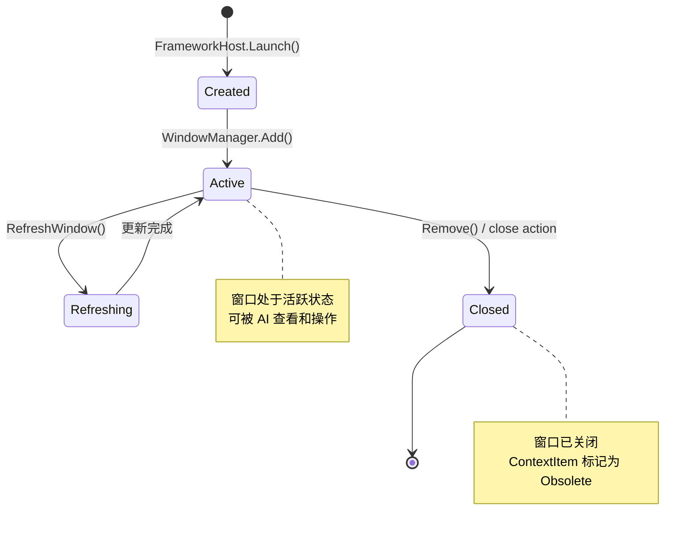

### 2.2 创建流程

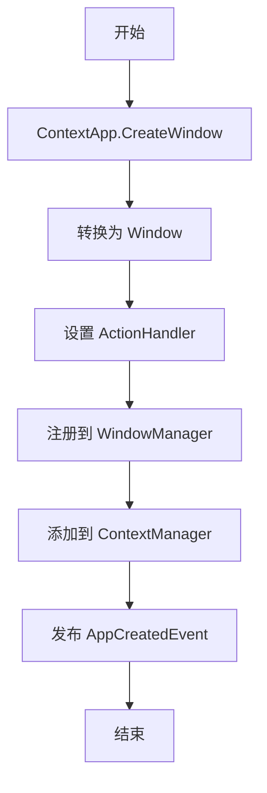

### 2.3 刷新机制

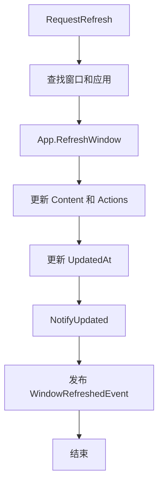

关键特性：
- **窗口 ID 不变**：保持在上下文中的位置
- **原地更新**：只更新内容，不重新创建
- **UpdatedAt 更新**：使用 `Clock.Next()` 获取新时间戳

### 2.4 关闭流程

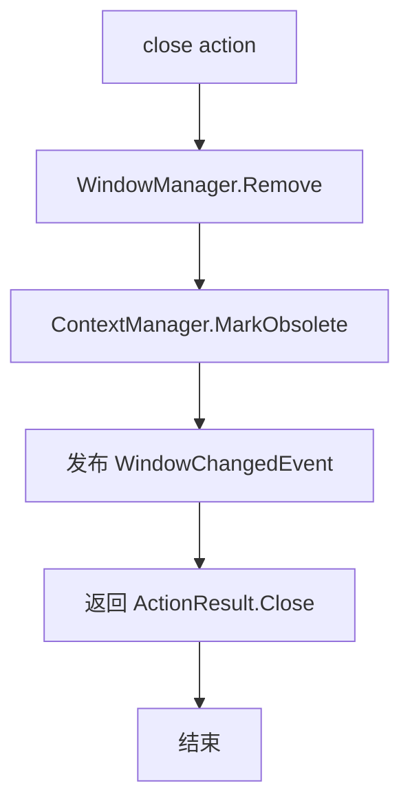

## 3. 上下文项生命周期

### 3.1 类型说明

| 类型 | 来源 | 生命周期 | 说明 |
|------|------|----------|------|
| System | 系统初始化 | 永久 | 系统提示词，永不删除 |
| User | 用户输入 | 可裁剪 | 用户消息 |
| Assistant | AI 响应 | 可裁剪 | AI 回复 |
| Window | 窗口创建 | 随窗口 | 关闭时标记过期 |

### 3.2 状态转换

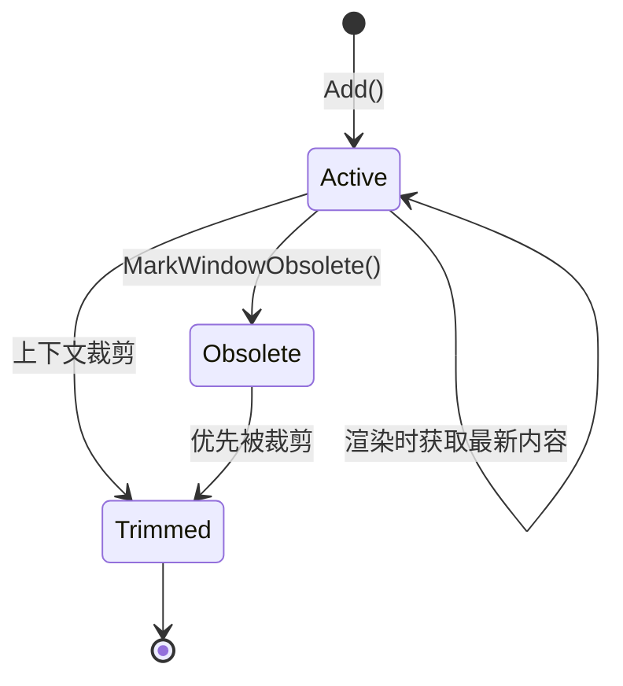

## 4. 会话生命周期

### 4.1 状态图

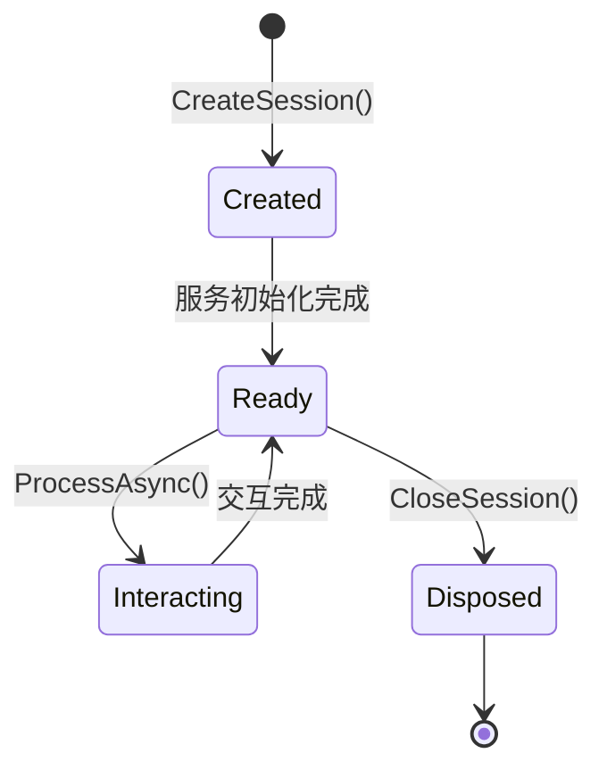

### 4.2 会话包含的资源

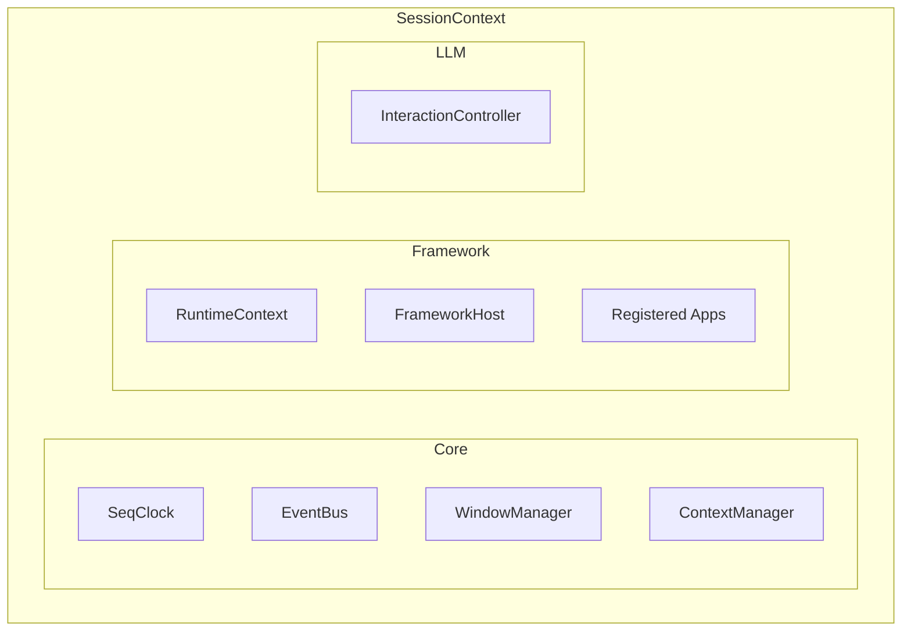

## 5. 事件流

### 5.1 事件发布点

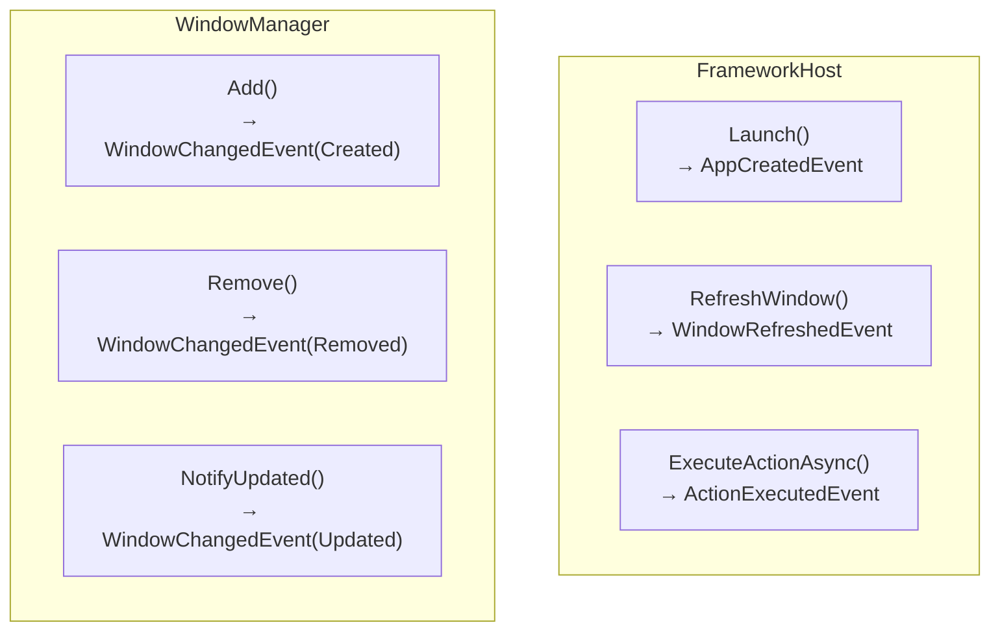

### 5.2 事件订阅示例

```csharp
// 订阅窗口变化
context.Events.Subscribe<WindowChangedEvent>(e =>
{
    switch (e.Type)
    {
        case WindowEventType.Created:
            Console.WriteLine($"窗口创建: {e.WindowId}");
            break;
        case WindowEventType.Updated:
            Console.WriteLine($"窗口更新: {e.WindowId}");
            break;
        case WindowEventType.Removed:
            Console.WriteLine($"窗口关闭: {e.WindowId}");
            break;
    }
});

// 订阅操作执行
context.Events.Subscribe<ActionExecutedEvent>(e =>
{
    Console.WriteLine($"操作执行: {e.ActionId} on {e.WindowId}");
});
```

## 6. Seq 分配流程

### 6.1 分配时机

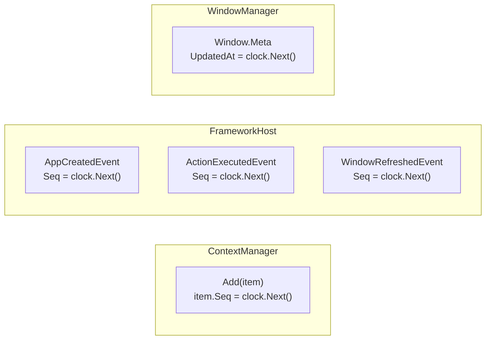

### 6.2 Seq 用途

| 用途 | 场景 | 意义 |
|------|------|------|
| 排序 | ContextItem.Seq | 确定上下文中的顺序 |
| 时间戳 | Event.Seq | 标记事件发生时间 |
| 版本 | Window.Meta.UpdatedAt | 追踪窗口更新 |

## 7. 数据一致性

### 7.1 单线程模型

每个 `SessionContext` 内部的操作是**同步**的：

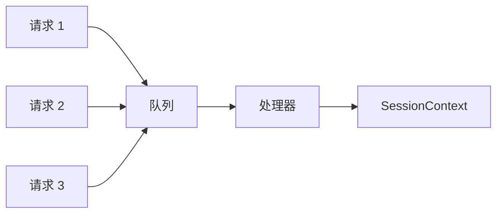

### 7.2 窗口引用一致性

`ContextItem` 存储的是窗口 **ID**，渲染时动态获取最新内容：

```csharp
// ContextItem 存储
new ContextItem
{
    Type = ContextItemType.Window,
    Content = windowId  // 只存储 ID
};

// 渲染时获取
var window = windowManager.Get(windowId);
if (window != null)
{
    return new LlmMessage { Content = window.Render() };
}
```

这确保了：
- 窗口刷新后，上下文自动反映最新状态
- 窗口关闭后，渲染返回 null，跳过该项
