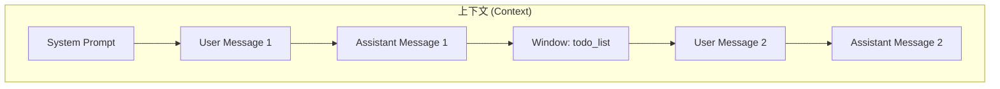
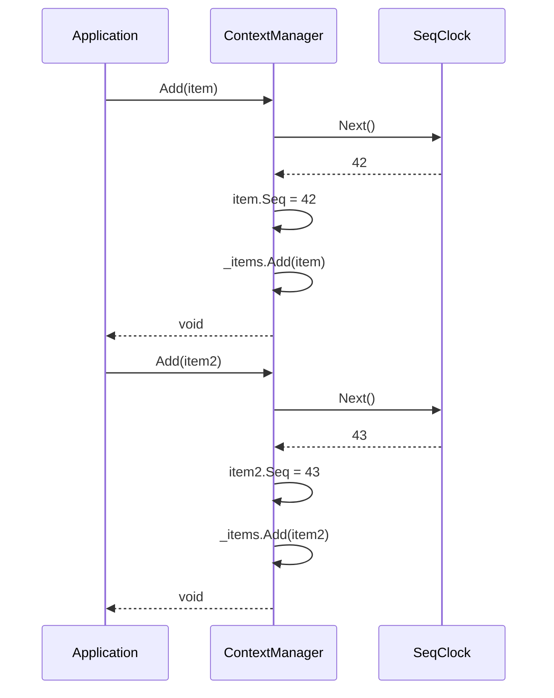
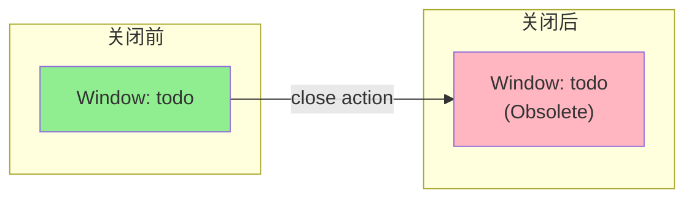
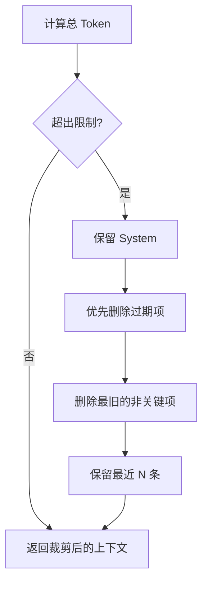
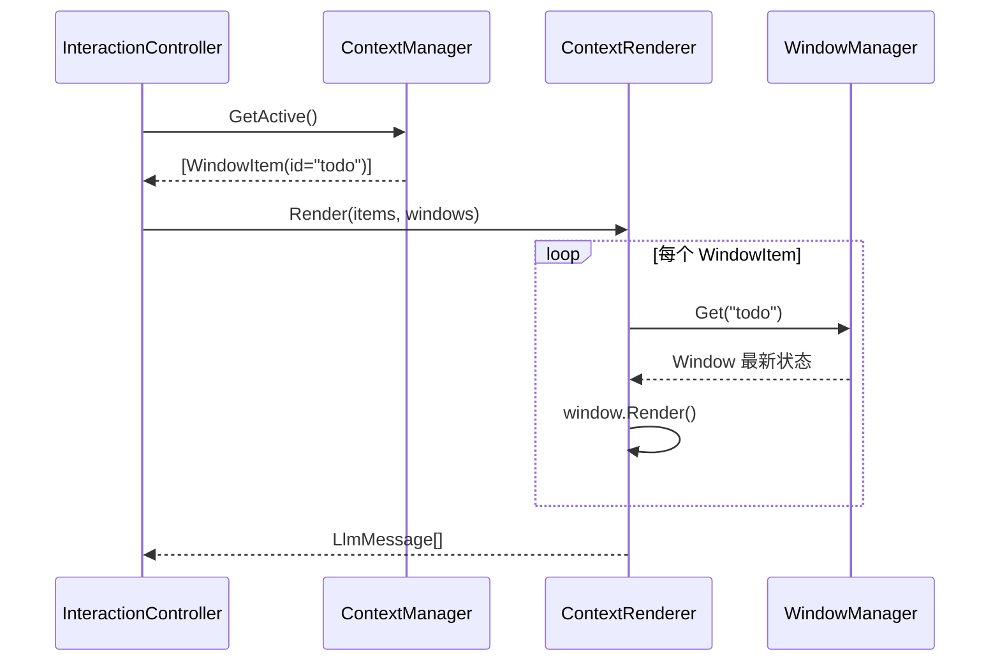

# 上下文管理详解

> 本文档深入解析 ContextUI 的上下文管理机制，包括上下文渲染、裁剪策略和 LLM 对话格式。

## 1. 上下文模型

### 1.1 概念图



### 1.2 ContextItem 结构

```csharp
public class ContextItem
{
    public string Id { get; set; }           // 唯一标识
    public ContextItemType Type { get; set; } // 类型
    public string Content { get; set; }       // 内容（或窗口 ID）
    public int Seq { get; set; }              // 逻辑时间戳
    public bool IsObsolete { get; set; }      // 是否过期
}
```

### 1.3 类型定义

| 类型 | Content 内容 | 渲染方式 |
|------|--------------|----------|
| `System` | 系统提示词文本 | 直接使用 |
| `User` | 用户消息文本 | 直接使用 |
| `Assistant` | AI 响应文本 | 直接使用 |
| `Window` | 窗口 ID | 动态获取窗口内容 |

## 2. 上下文管理器

### 2.1 接口定义

```csharp
public interface IContextManager
{
    /// <summary>
    /// 当前序列号
    /// </summary>
    int CurrentSeq { get; }
    
    /// <summary>
    /// 添加上下文项（自动分配 Seq）
    /// </summary>
    void Add(ContextItem item);
    
    /// <summary>
    /// 获取所有上下文项（按 Seq 排序）
    /// </summary>
    IReadOnlyList<ContextItem> GetAll();
    
    /// <summary>
    /// 获取活跃的上下文项（排除过期项）
    /// </summary>
    IReadOnlyList<ContextItem> GetActive();
    
    /// <summary>
    /// 标记窗口相关项为过期
    /// </summary>
    void MarkWindowObsolete(string windowId);
}
```

### 2.2 Seq 分配机制



**关键点：**
- Seq 由 ContextManager 统一分配
- 调用者不需要自己设置 Seq
- 保证全局唯一且单调递增

## 3. 上下文渲染

### 3.1 渲染器接口

```csharp
public interface IContextRenderer
{
    IEnumerable<LlmMessage> Render(
        IEnumerable<ContextItem> items,
        IWindowManager windows,
        RenderOptions options);
}

public class RenderOptions
{
    public int? MaxTokens { get; set; }
    public bool IncludeSystemPrompt { get; set; } = true;
    public bool IncludeObsolete { get; set; } = false;
}
```

### 3.2 渲染流程

```mermaid
flowchart TD
    START[GetActive()]
    SORT[按 Seq 排序]
    FOREACH{遍历每项}
    
    CHECK_SYSTEM{System?}
    CHECK_USER{User?}
    CHECK_ASSISTANT{Assistant?}
    CHECK_WINDOW{Window?}
    
    RENDER_SYSTEM[role: system]
    RENDER_USER[role: user]
    RENDER_ASSISTANT[role: assistant]
    
    GET_WINDOW[WindowManager.Get]
    CHECK_NULL{窗口存在?}
    RENDER_WINDOW[window.Render]
    SKIP[跳过]
    
    COLLECT[收集 LlmMessage]
    END[返回消息列表]
    
    START --> SORT --> FOREACH
    FOREACH --> CHECK_SYSTEM --> RENDER_SYSTEM --> COLLECT
    FOREACH --> CHECK_USER --> RENDER_USER --> COLLECT
    FOREACH --> CHECK_ASSISTANT --> RENDER_ASSISTANT --> COLLECT
    FOREACH --> CHECK_WINDOW --> GET_WINDOW --> CHECK_NULL
    CHECK_NULL -->|是| RENDER_WINDOW --> COLLECT
    CHECK_NULL -->|否| SKIP --> FOREACH
    
    COLLECT --> FOREACH
    FOREACH -->|完成| END
```

### 3.3 窗口渲染示例

```xml
<!-- User 创建待办 -->
<role>user</role>
帮我创建一个待办列表

<!-- Assistant 响应 -->
<role>assistant</role>
好的，我来帮你创建待办列表。
<tool_call>{"name": "create", "arguments": {"name": "todo"}}</tool_call>

<!-- Window 状态 -->
<role>user</role>
<Window id="todo_12345">
  <Description>待办事项管理应用</Description>
  <Content>
    <item id="1">买菜</item>
    <item id="2">写代码</item>
  </Content>
  <Actions>
    <action id="add" params="text:string">添加条目</action>
    <action id="delete" params="index:int">删除条目</action>
    <action id="close" params="summary:string?">关闭</action>
  </Actions>
</Window>
```

## 4. 过期机制

### 4.1 过期触发

窗口关闭时触发过期标记：

```csharp
public void MarkWindowObsolete(string windowId)
{
    foreach (var item in _items)
    {
        if (item.Type == ContextItemType.Window && 
            item.Content == windowId)
        {
            item.IsObsolete = true;
        }
    }
}
```

### 4.2 过期效果



过期项在 `GetActive()` 中被过滤：

```csharp
public IReadOnlyList<ContextItem> GetActive()
{
    return _items
        .Where(i => !i.IsObsolete)
        .OrderBy(i => i.Seq)
        .ToList();
}
```

## 5. 上下文裁剪

### 5.1 裁剪策略

当上下文过长时，需要裁剪以适应 Token 限制：



### 5.2 裁剪优先级

| 优先级 | 类型 | 说明 |
|--------|------|------|
| 最高 | System | 永不删除 |
| 高 | 最近 3 轮对话 | 保持上下文连贯 |
| 中 | 活跃窗口 | 保持可操作性 |
| 低 | 旧的 User/Assistant | 可被裁剪 |
| 最低 | 过期窗口 | 优先删除 |

### 5.3 实现示例

```csharp
public IEnumerable<ContextItem> Trim(
    IEnumerable<ContextItem> items, 
    int maxTokens)
{
    var result = new List<ContextItem>();
    var tokenCount = 0;
    
    // 1. 始终保留 System
    var systemItem = items.FirstOrDefault(i => i.Type == ContextItemType.System);
    if (systemItem != null)
    {
        result.Add(systemItem);
        tokenCount += EstimateTokens(systemItem);
    }
    
    // 2. 从最新到最旧遍历
    foreach (var item in items
        .Where(i => i.Type != ContextItemType.System)
        .OrderByDescending(i => i.Seq))
    {
        var itemTokens = EstimateTokens(item);
        
        // 3. 优先删除过期项
        if (item.IsObsolete && tokenCount + itemTokens > maxTokens)
            continue;
        
        if (tokenCount + itemTokens <= maxTokens)
        {
            result.Add(item);
            tokenCount += itemTokens;
        }
    }
    
    // 4. 恢复正确顺序
    return result.OrderBy(i => i.Seq);
}
```

## 6. 动态窗口内容

### 6.1 设计理念

**问题**：窗口状态会变化，如何保持上下文中的窗口内容最新？

**解决**：ContextItem 只存储窗口 **ID**，渲染时动态获取最新内容。



### 6.2 优势

| 场景 | 静态存储 | 动态获取 |
|------|----------|----------|
| 窗口刷新 | 需要更新所有引用 | 自动反映最新 |
| 窗口关闭 | 需要清理历史 | 自动跳过 |
| 多次引用 | 可能不一致 | 始终一致 |

## 7. LLM 消息格式

### 7.1 消息结构

```typescript
interface LlmMessage {
  role: "system" | "user" | "assistant";
  content: string;
}
```

### 7.2 完整对话示例

```json
[
  {
    "role": "system",
    "content": "你是 ContextUI 助手..."
  },
  {
    "role": "user",
    "content": "创建一个待办列表"
  },
  {
    "role": "assistant",
    "content": "好的，我来帮你创建...<tool_call>...</tool_call>"
  },
  {
    "role": "user",
    "content": "<Window id=\"todo_123\">...</Window>"
  },
  {
    "role": "user",
    "content": "添加一个条目：买菜"
  },
  {
    "role": "assistant",
    "content": "已添加...<tool_call>...</tool_call>"
  }
]
```

**注意**：Window 渲染为 `role: user`，这是因为：
- 窗口状态是系统提供给 AI 的信息
- AI 需要基于窗口状态做出决策
- 使用 user role 确保 AI 能够"看到"窗口

## 8. 上下文监控

### 8.1 统计信息

```csharp
public class ContextStats
{
    public int TotalItems { get; set; }
    public int ActiveItems { get; set; }
    public int ObsoleteItems { get; set; }
    public int WindowItems { get; set; }
    public int EstimatedTokens { get; set; }
}

public ContextStats GetStats()
{
    var all = GetAll();
    return new ContextStats
    {
        TotalItems = all.Count,
        ActiveItems = all.Count(i => !i.IsObsolete),
        ObsoleteItems = all.Count(i => i.IsObsolete),
        WindowItems = all.Count(i => i.Type == ContextItemType.Window),
        EstimatedTokens = all.Sum(EstimateTokens)
    };
}
```

### 8.2 调试输出

```csharp
// 打印上下文概要
foreach (var item in context.GetAll())
{
    var status = item.IsObsolete ? "[X]" : "[✓]";
    Console.WriteLine($"{status} [{item.Seq:D4}] {item.Type}: {Truncate(item.Content, 50)}");
}

// 输出示例：
// [✓] [0001] System: 你是 ContextUI 助手...
// [✓] [0002] User: 创建一个待办列表
// [✓] [0003] Assistant: 好的，我来帮你创建...
// [✓] [0004] Window: todo_12345
// [X] [0005] Window: temp_67890  <- 已关闭的窗口
```
